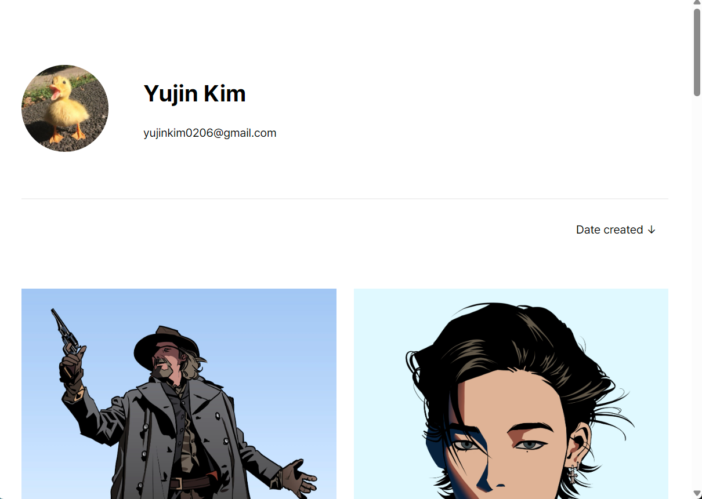

# Gallery

This is an illustration gallery built with HTML, CSS, and JavaScript. It displays artworks in a masonry layout, supports sorting by date, and includes a fullscreen viewer with zoom and optional video playback for selected pieces. ([https://yujinkim0206.github.io/gallery/](https://yujinkim0206.github.io/gallery/))

  


## Features
- Masonry layout
- Sorting by date
- Fullscreen viewer with zoom
- Video playback

## Running Locally
From the project folder, run:
```bash
python -m http.server 8000
```
Then open http://localhost:8000 in your browser.
